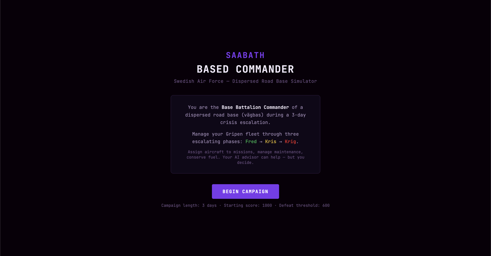
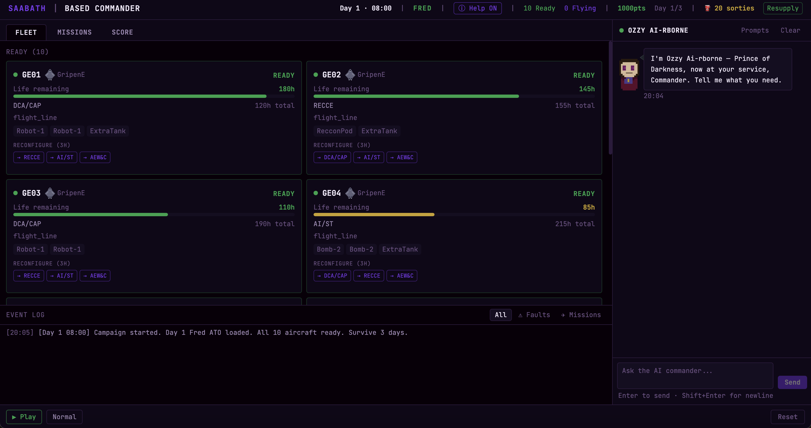
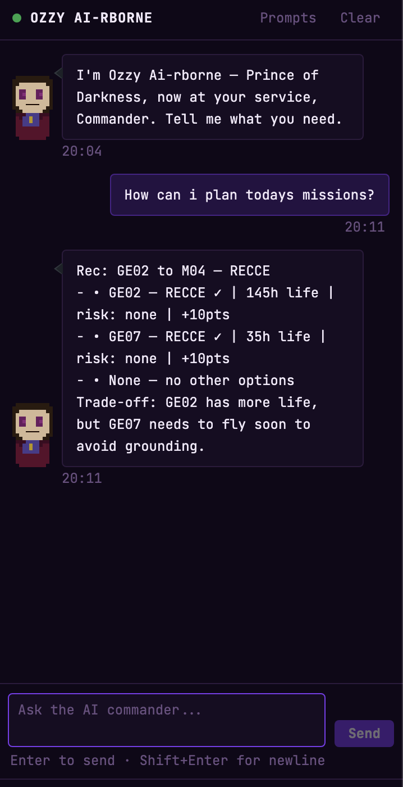
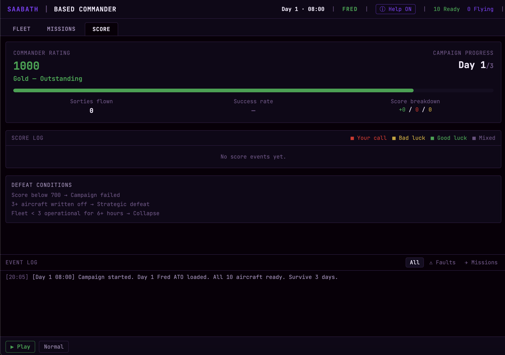

# SAAB Smart Air Base Hackathon
**Tekniska Museet, Stockholm**  
March 14th, 2026

## Team: Black Saabath Saaboteurs
The team was composed of three developers:
- @dev1 
- @dev2  
- @dev 3

## Description

Our entry to the SAAB Smart Air Base Hackathon is a flightbase simulation integrated with an AI-driven decision support chatbot. The simulation lets you assign aircraft to missions, perform maintenance and configurations and play through peace, crisis and war time with random unexpected events happening throughout the simulated day.

## Synopsis & Motivation

Saabath Based Commander aims to demonstrate how decision support can be utilized with LLM models to get reliable tactical support quickly and reduce cognitive effort. To further expand and improve the quality of responses, the simulation could be ran in a re-enforcement learning loop to iteratively evaluate and adjust responses based on campaign scores. In a potential conflict with limited resources, an LLM could be of use to effectivize and guide decisions.

We chose to interpret the project as a simple event-driven game, with rougelike/strategy elements, in order to simulate situations an air base commander may encounter. You make the decisions about what planes to send on varying missions, deal with semi-random incidents, such as scrambles, unplanned missions and fleet failures. The decisions are made by you, but the consequences and trade-offs can always e discussed with the rocking AI assistant, Ozzy AI-rborne. Earn points by making good decisions, or risk an early game over-screen.

## Technology

- Backend: Python with FastAPI
- Frontend: React with Tailwind
- Coding Assistant: Claude Code

## Preview

